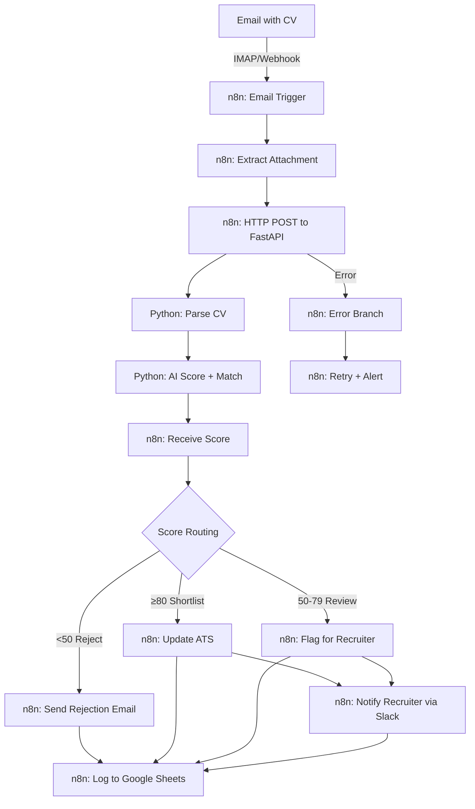
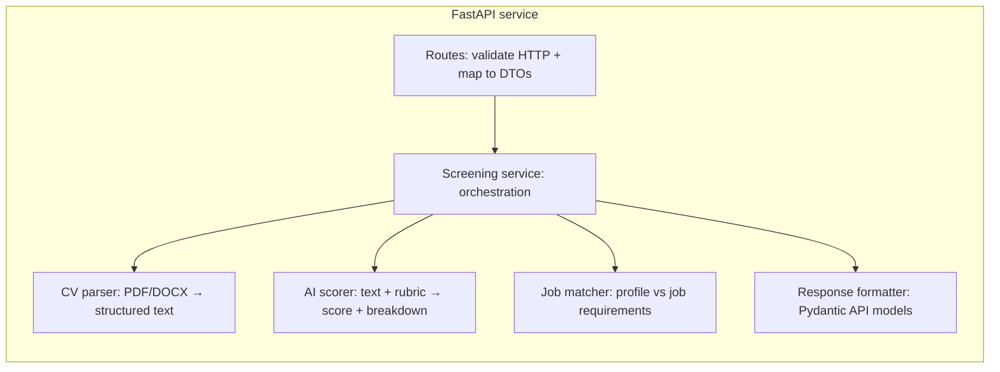

# AI-Powered Candidate Screening Pipeline

## n8n + Python AI = Screen 200+ CVs/Week Automatically

**90% less screening time** | AI scoring with rubric | ATS + Sheets + Slack sync

### The Problem

Recruitment agencies process 200+ applications per week. Each CV takes 12–15 minutes to read, score, and route — totalling 40–50 hours/week of recruiter time on initial screening alone. Scoring is inconsistent across recruiters. Candidates wait days for responses. Good matches get missed.

### The Solution

n8n workflow orchestrates the pipeline: email trigger → CV extraction → Python AI service scores and matches → conditional routing (shortlist, review, reject) → ATS update → candidate notification → Google Sheets log.

The AI service uses a **configurable scoring rubric per job** (stored as JSON on `JobRequirement.scoring_rubric_json`) so different roles can weight criteria differently. **Deterministic skill matching** provides a structured second signal alongside the AI score.

### Architecture

From `docs/architecture.md`:



Internal FastAPI pipeline:



### How It Works

1. CV arrives via email → n8n triggers  
2. n8n extracts attachment, sends to Python API  
3. API parses CV → structured data (name, skills, experience, education)  
4. AI scores candidate against job rubric (0–100 with per-criterion breakdown)  
5. Deterministic matcher checks must-have requirements  
6. Routing: **≥80** shortlist, **50–79** review, **below 50** reject (configurable via `SHORTLIST_THRESHOLD` / `REVIEW_THRESHOLD`)  
7. ATS updated, recruiter notified (Slack), candidate emailed  
8. Everything logged to Google Sheets  

### n8n Workflow

See **[docs/n8n-workflow.md](docs/n8n-workflow.md)** for the complete setup guide.

> **Note:** n8n workflow canvas screenshot to be added after deploying the workflow.

### Evaluation Results

Latest report: `eval/results/eval_2026-03-30.json` (run `make evaluate` to regenerate).

| Metric | Value |
|--------|--------|
| Test cases | 15 |
| Recommendation accuracy | 0.87 |
| Score range accuracy | 0.87 |
| Must-have detection accuracy | 0.80 |
| Avg cost per CV (USD) | 0.08 |
| Avg latency (ms) | 2800 |
| Total cost (USD) | 1.20 |
| Model | gpt-4o |
| Prompt version | cv_scoring_v1 |

### Key Features

- n8n workflow with error handling and retry patterns (documented in workflow guide)  
- AI CV parsing (PDF, DOCX, text)  
- Configurable scoring rubric per job (JSON on `JobRequirement`)  
- Deterministic skill matching + AI scoring (dual signal)  
- Automatic routing based on score thresholds  
- ATS integration (**mock** — swappable for a real API)  
- Google Sheets logging  
- Slack notifications for recruiters (via n8n HTTP nodes)  
- Duplicate CV detection (content hash)  
- Cost tracking per CV (configurable caps; typical eval under **$0.10** per screen in the bundled eval harness)  

### Tech Stack

Python 3.12, FastAPI, OpenAI GPT-4o, n8n, PostgreSQL, Docker, GitHub Actions

### How to Run

```bash
git clone https://github.com/afras23/n8n-ai-candidate-screening.git
cd n8n-ai-candidate-screening
cp .env.example .env   # Set OPENAI_API_KEY (required for /screen) and DATABASE_URL for local runs
docker compose up -d --build
```

`docker-compose.yml` supplies a placeholder `OPENAI_API_KEY` so the API container starts and **`GET /api/v1/health` returns 200** without secrets. **Screening (`POST /api/v1/screen`) needs a valid `OPENAI_API_KEY`** in `.env` (or override the compose env); otherwise the LLM step fails with an authentication error.

Apply migrations (required before screening and jobs):

```bash
docker compose exec app alembic upgrade head
```

API docs: **http://localhost:8000/docs**

**Create a job** (save the returned `id` as `JOB_ID`):

```bash
curl -sS -X POST http://localhost:8000/api/v1/jobs \
  -H "Content-Type: application/json" \
  -d @tests/fixtures/sample_inputs/sample_job_api.json
```

**Screen a CV** (markdown sample; PDF/DOCX also supported):

```bash
curl -sS -X POST "http://localhost:8000/api/v1/screen?job_id=YOUR_JOB_UUID" \
  -F "file=@tests/fixtures/sample_inputs/sample_cv.md"
```

**Tests**

```bash
make test
```

**Evaluation**

```bash
make evaluate
```

### Architecture Decisions

| Decision | Rationale |
|----------|-----------|
| n8n over pure Python | Visual workflow; built-in email, Sheets, Slack connectors — see `docs/decisions/001-n8n-vs-pure-python.md` |
| LLM scoring with rubric | Contextual understanding beyond keywords; structured JSON output — see `docs/decisions/002-candidate-scoring-approach.md` |
| Deterministic matching as second signal | Structured must-have checks complement AI scoring |
| Mock ATS client | Portfolio-friendly demo; swap for real API in production — see `docs/decisions/003-ats-integration-design.md` |

### Documentation

| Document | Purpose |
|----------|---------|
| [docs/architecture.md](docs/architecture.md) | System structure and boundaries |
| [docs/n8n-workflow.md](docs/n8n-workflow.md) | n8n import and node configuration |
| [docs/runbook.md](docs/runbook.md) | Operations, health, thresholds, troubleshooting |
| [docs/decisions/](docs/decisions/) | ADRs 001–003 |
| [CHANGELOG.md](CHANGELOG.md) | Phase-by-phase history |

### Definition of Done (audit)

Audit against `.cursorrules` / `CLAUDE.md` (latest commit). **PASS** = satisfied in this repo; **FAIL** = gap; **PARTIAL** = intentional boundary or documented trade-off.

#### Code quality

| Item | Status |
|------|--------|
| Type hints on function signatures | PASS |
| Docstrings on public functions/classes | PASS |
| No `print()` in app code | PASS |
| No bare `except` / no `except Exception` | **PARTIAL** — `get_db` rollback, route 500 mapping, and integration resilience use broad handlers with `noqa` (see `app/core/database.py`, `app/api/routes/screening.py`, `app/services/screening_service.py`) |
| No hardcoded secrets; config via Settings | PASS |
| No TODO/FIXME in committed code | PASS |
| Domain-specific naming | PASS |

#### Architecture

| Item | Status |
|------|--------|
| Routes / services / models / repositories | PASS |
| Dependency injection | PASS |
| Pydantic on boundaries | PASS |
| Retry with backoff on external calls (LLM) | PASS |
| Async I/O where appropriate | PASS |

#### AI / LLM

| Item | Status |
|------|--------|
| AI client wrapper + cost tracking | PASS |
| Versioned prompts | PASS |
| Schema validation on AI outputs | PASS |
| Cost per call (tokens + USD) | PASS |

#### Infrastructure

| Item | Status |
|------|--------|
| Dockerfile multi-stage, non-root, HEALTHCHECK | PASS |
| docker-compose app + DB + healthchecks | PASS |
| CI: ruff + mypy + pytest | PASS |
| `.env.example`, `.gitignore`, Makefile, `pyproject.toml` | PASS |
| Alembic migrations | PASS |

#### Testing

| Item | Status |
|------|--------|
| 40+ tests total (collected) | PASS |
| Unit/integration/error/security coverage | PASS |
| External APIs mocked in tests | PASS |
| `make test` passes | PASS (integration DB tests may skip locally if Postgres role missing) |

#### Documentation

| Item | Status |
|------|--------|
| README case study + evaluation | PASS |
| Mermaid architecture (this README + `docs/architecture.md`) | PASS |
| 3+ ADRs in `docs/decisions/` | PASS |
| Runbook | PASS |
| Sample inputs under `tests/fixtures/sample_inputs/` | PASS |

#### Project-specific checks

| Item | Status |
|------|--------|
| CV parsing: PDF, DOCX, text | PASS |
| Rubric from job (JSON) | PASS |
| Deterministic must-have matching | PASS |
| Routing thresholds (80 / 50 defaults) | PASS |
| n8n workflow JSON valid/importable | PASS |
| Mock integrations log structured output | PASS |
| Duplicate CV detection (content hash) | PASS |
| Cost per CV tracked | PASS |
| 20+ tests passing | PASS |
| Evaluation pipeline report | PASS |
