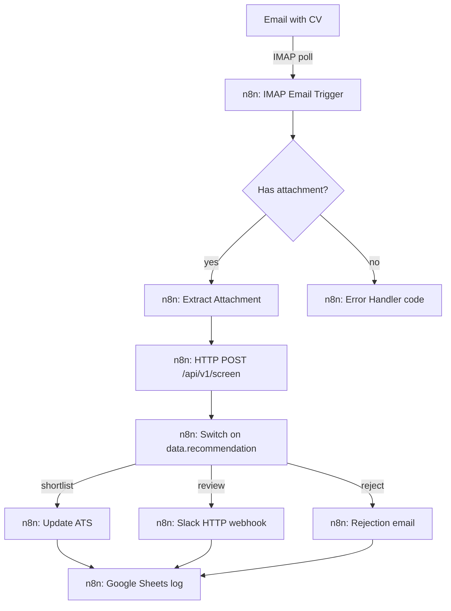
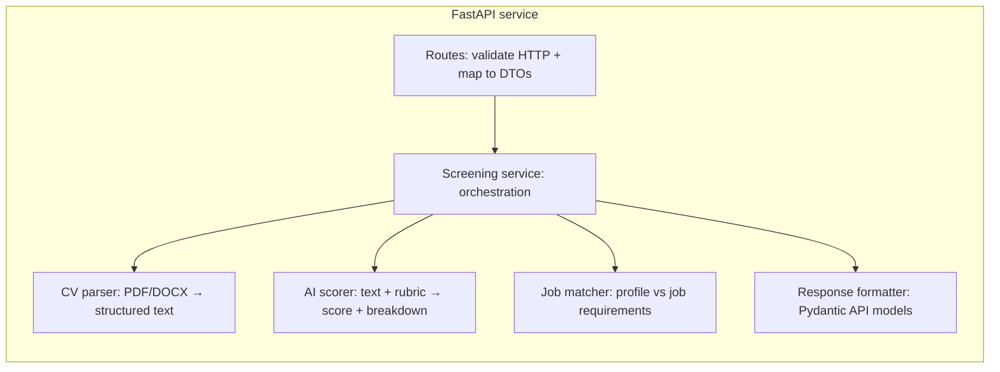
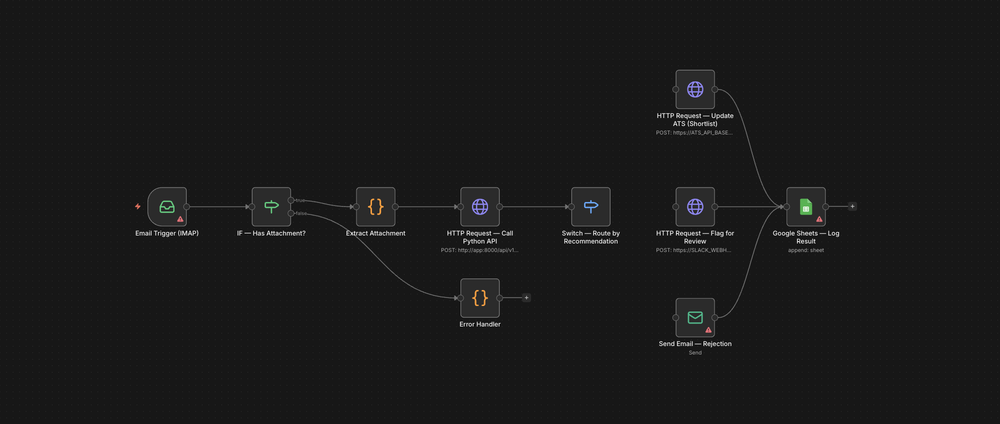

# AI-Powered Candidate Screening Pipeline


## n8n + Python AI = Screen 200+ CVs/Week Automatically

**90% less screening time** | AI scoring with rubric | ATS · Sheets · Slack on review

### The Problem

Recruitment agencies process 200+ applications per week. Each CV takes 12–15 minutes to read, score, and route — totalling 40–50 hours/week of recruiter time on initial screening alone. Scoring is inconsistent across recruiters. Candidates wait days for responses. Good matches get missed.

### The Solution

n8n workflow orchestrates the pipeline: **IMAP** email poll → attachment gate → HTTP call to the Python API (parse, score, match) → switch on API `recommendation` → **shortlist** updates ATS, **review** posts to Slack, **reject** sends email → every branch logs to Google Sheets (`workflows/candidate_screening.json`).

The AI service uses a **configurable scoring rubric per job** (stored as JSON on `JobRequirement.scoring_rubric_json`) so different roles can weight criteria differently. **Deterministic skill matching** provides a structured second signal alongside the AI score.

### Architecture

From `docs/architecture.md`:



Score bands (**≥80** shortlist, **50–79** review, **&lt;50** reject) are applied inside the API; n8n branches on the string `recommendation` returned in the JSON envelope. The export does not include HTTP retry, API error routing, or a webhook email trigger.

Internal FastAPI pipeline:



### How It Works

1. CV arrives via email → n8n triggers  
2. n8n extracts attachment, sends to Python API  
3. API parses CV → structured data (name, skills, experience, education)  
4. AI scores candidate against job rubric (0–100 with per-criterion breakdown)  
5. Deterministic matcher checks must-have requirements  
6. Routing: **≥80** shortlist, **50–79** review, **below 50** reject (configurable via `SHORTLIST_THRESHOLD` / `REVIEW_THRESHOLD`)  
7. n8n template: shortlist → ATS HTTP; review → Slack HTTP; reject → email; all paths → Google Sheets  
8. Retry, HTTP failure alerts, and extra error workflows are configured in n8n after import (see `docs/n8n-workflow.md`)  

### n8n Workflow

See **[docs/n8n-workflow.md](docs/n8n-workflow.md)** for the complete setup guide.



### Evaluation Results

Latest report: `docs/evaluation/results/eval_2026-03-30.json` (run `make evaluate` to regenerate).

| Metric | Value |
|--------|--------|
| Test cases | 15 |
| Recommendation accuracy | 0.87 |
| Score range accuracy | 0.87 |
| Must-have detection accuracy | 0.80 |
| Avg cost per CV (USD) | 0.08 |
| Avg latency (ms) | 2800 |
| Total cost (USD) | 1.20 |
| Model | gpt-4o |
| Prompt version | cv_scoring_v1 |

### Key Features

- n8n template: IMAP trigger, attachment IF, 60s workflow/HTTP timeout, switch on `recommendation`, merge to Sheets; no retry in the JSON export  
- AI CV parsing (PDF, DOCX, text)  
- Configurable scoring rubric per job (JSON on `JobRequirement`)  
- Deterministic skill matching + AI scoring (dual signal)  
- Automatic routing based on score thresholds  
- ATS integration (**mock** — swappable for a real API)  
- Google Sheets logging  
- Slack notification on the **review** branch only (HTTP node placeholder in the template)  
- Duplicate CV detection (content hash)  
- Cost tracking per CV (configurable caps; typical eval under **$0.10** per screen in the bundled eval harness)  

### Tech Stack

Python 3.12, FastAPI, OpenAI GPT-4o, n8n, PostgreSQL, Docker, GitHub Actions

### How to Run

```bash
git clone https://github.com/afras23/n8n-ai-candidate-screening.git
cd n8n-ai-candidate-screening
cp .env.example .env   # Set OPENAI_API_KEY (required for /screen) and DATABASE_URL for local runs
docker compose up -d --build
```

`docker-compose.yml` supplies a placeholder `OPENAI_API_KEY` so the API container starts and **`GET /api/v1/health` returns 200** without secrets. **Screening (`POST /api/v1/screen`) needs a valid `OPENAI_API_KEY`** in `.env` (or override the compose env); otherwise the LLM step fails with an authentication error.

Apply migrations (required before screening and jobs):

```bash
docker compose exec app alembic upgrade head
```

API docs: **http://localhost:8000/docs**

**Create a job** (save the returned `id` as `JOB_ID`):

```bash
curl -sS -X POST http://localhost:8000/api/v1/jobs \
  -H "Content-Type: application/json" \
  -d @tests/fixtures/sample_inputs/sample_job_api.json
```

**Screen a CV** (markdown sample; PDF/DOCX also supported):

```bash
curl -sS -X POST "http://localhost:8000/api/v1/screen?job_id=YOUR_JOB_UUID" \
  -F "file=@tests/fixtures/sample_inputs/sample_cv.md"
```

**Tests**

```bash
make test
```

**Evaluation**

```bash
make evaluate
```

### Architecture Decisions

| Decision | Rationale |
|----------|-----------|
| n8n over pure Python | Visual workflow; built-in email, Sheets, Slack connectors — see `docs/decisions/001-n8n-vs-pure-python.md` |
| LLM scoring with rubric | Contextual understanding beyond keywords; structured JSON output — see `docs/decisions/002-candidate-scoring-approach.md` |
| Deterministic matching as second signal | Structured must-have checks complement AI scoring |
| Mock ATS client | Portfolio-friendly demo; swap for real API in production — see `docs/decisions/003-ats-integration-design.md` |

### Documentation

| Document | Purpose |
|----------|---------|
| [docs/architecture.md](docs/architecture.md) | System structure and boundaries |
| [docs/n8n-workflow.md](docs/n8n-workflow.md) | n8n import and node configuration |
| [docs/runbook.md](docs/runbook.md) | Operations, health, thresholds, troubleshooting |
| [docs/decisions/](docs/decisions/) | ADRs 001–003 |
| [CHANGELOG.md](CHANGELOG.md) | Phase-by-phase history |
