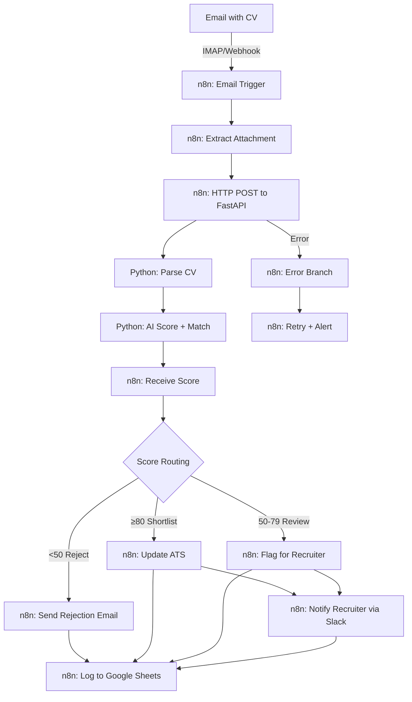
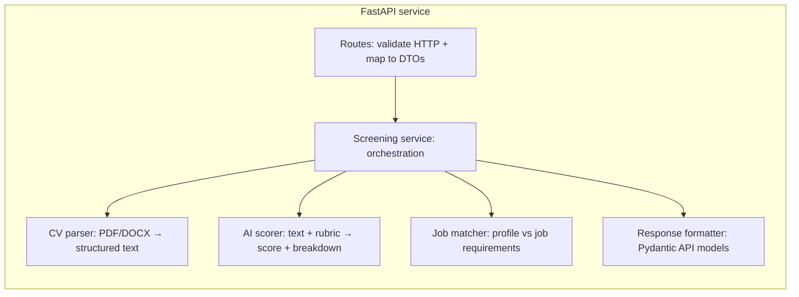

# Architecture: Hybrid n8n + FastAPI Candidate Screening

This document is the structural source of truth for the hybrid system: **n8n** owns orchestration, integrations, and routing; **Python FastAPI** owns CV parsing, AI scoring, job matching, and validated API responses. Future application code must keep **business logic out of HTTP routes** (validate → delegate to services → return formatted responses), per `docs/PORTFOLIO-ENGINEERING-STANDARD.md` and `docs/AI-ENGINEERING-PLAYBOOK.md`.

See also: `docs/problem-definition.md` for business context and success criteria.

## System overview (orchestration)

### Responsibility split

| Concern | Owner |
|--------|--------|
| Email trigger, attachment handling, retries, Slack/Sheets/ATS wiring | n8n |
| PDF/DOCX → text, LLM calls, rubric-backed scoring, Pydantic schemas, observability on the API | FastAPI service |
| Final routing thresholds (80 / 50) as workflow policy | n8n (configurable nodes); API returns structured recommendation |

## Python FastAPI service (internal)

The HTTP layer exposes versioned endpoints (e.g. under `/api/v1`). Internally, processing follows a **linear pipeline** inside a service layer (not inside route handlers):

| Component | Responsibility |
|-----------|----------------|
| **CV parser** | Extract machine-readable text; detect empty/image-only PDFs; surface parse status for n8n branches |
| **AI scorer** | Call LLM via a single client wrapper; enforce structured output; log cost, latency, tokens, model, prompt version |
| **Job matcher** | Apply job requirements (from config/DB) to the scored profile; align with rubric weights |
| **Response formatter** | Build stable JSON/Pydantic responses (score 0–100, per-criterion breakdown, recommendation, flags for manual review) |

### Integration boundary

- n8n calls FastAPI with **CV content (or extracted text)** + **job identifier**; FastAPI returns a **validated screening result** only.
- ATS updates, rejection emails, and Sheets rows remain **n8n** concerns unless a later ADR moves them behind a dedicated integration service.

## Cross-cutting concerns (target state)

- **Configuration:** environment variables via Pydantic Settings (no secrets in workflows committed to git).
- **Observability:** structured logs with correlation ID; health/ready/metrics on the API; n8n execution logs for workflow failures.
- **Safety:** borderline scores and parse failures must not auto-reject without human review (see `docs/problem-definition.md`).
